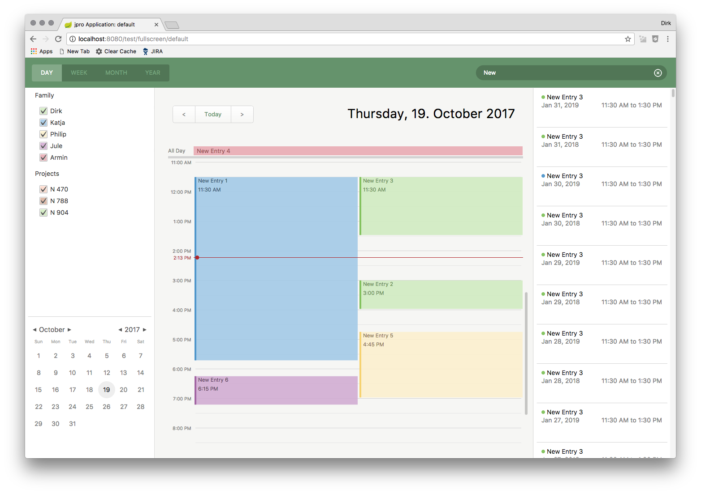

[JPro](https://www.jpro.one/) can be used to run JavaFX in the browser.

This application can be viewed here: https://demos.jpro.one/calendar.html




# How to start JProCalendarFX #


## Web Browser ##

### Start JPro in foreground (development mode) ###

```
gradle jproRun
```


### Start JPro in background (server mode) ###

```
gradle jproRestart
```


### Open JPro app in Web Browser ###
```
http://localhost:8080/index.html
```

### Show all JPro apps in Browser ####
```
http://localhost:8080/test/default
```

### Open JPro app in fullscreen ####
```
http://localhost:8080/test/fullscreen/[app-name]
```


